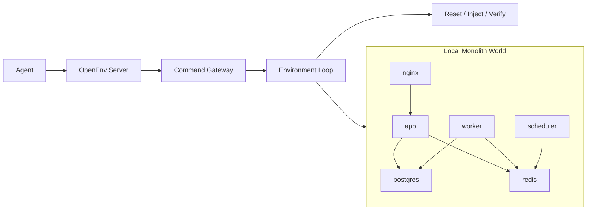

# Production Ops Lab v1

Production Ops Lab is a compact OpenEnv benchmark where an agent acts as the on-call production engineer for a single-host modular monolith. The agent gets a constrained production-ops command surface, partial but useful observations, deterministic reset, and programmatic grading across six incident-response tasks.

## What Is Production Ops Lab

Production Ops Lab is a Round 1 incident-response environment for agentic RL.

- Single-host modular monolith world
- Safe ops command surface instead of raw shell
- Deterministic reset, injection, and verification
- Six hand-authored incident tasks
- HF-compatible runtime inside one Space container

The benchmark is designed to reward operational reasoning, not prompt memorization.

## Why This Is A Meaningful RL Environment

This environment is useful because success depends on workflow quality.

- Partial observability: alerts expose symptoms, not hidden root cause.
- Diagnosis before repair: the agent must choose what to inspect first.
- Verification required: a fix command alone does not end the episode.
- Deterministic resets and graders: same scenario, same commands, same outcome.
- Compact but realistic world: health, reads, writes, and async processing all matter.

## World Design

The world is a single-host modular monolith with six components:

- `nginx`: ingress surface
- `app`: main application runtime
- `postgres`: relational store
- `redis`: queue and heartbeat state
- `worker`: background job processor
- `scheduler`: background support heartbeat

The world supports the benchmark behaviors that matter:

- public health checks
- candidate search read path
- application creation write path
- queue-backed async processing

The backend is HF-compatible and runs inside the Space runtime without nested Docker orchestration for the monolith world.

## Architecture Diagram



## Action / Observation / State

### Action

| Type | Public fields |
| --- | --- |
| `ProductionOpsLabAction` | `command` |

The agent sends one command per turn.

### Observation

| Type | Public fields |
| --- | --- |
| `ProductionOpsLabObservation` | `alert_message`, `command_output`, `visible_health_summary`, `system_snapshot`, `steps_taken`, `max_steps`, `available_commands_hint`, `success`, `error`, `active_incidents`, `hint`, inherited OpenEnv `reward` and `done` |

Observations are useful but safe:

- they expose visible symptoms and command results
- they do not expose root cause, accepted fixes, or private grader truth

### State

| Type | Public fields |
| --- | --- |
| `ProductionOpsState` | `task_id`, `difficulty`, `step_count`, `max_steps`, `cumulative_reward`, `incident_resolved`, `last_command`, `command_history` |

State stays safe and excludes hidden grading data.

## Incident Tasks

| Task | Difficulty | Visible symptom | Core fix path | Verification signal |
| --- | --- | --- | --- | --- |
| `app_service_stopped` | Easy | App stopped, `/health` degraded | `svc restart app` | `http check /health` or `lab verify` |
| `nginx_service_stopped` | Easy | Ingress stopped, public health failing | `svc restart nginx` | `http check /health` or `lab verify` |
| `bad_env_db_url` | Medium | App degraded, DB-backed behavior failing | `env set app DATABASE_URL=correct` then `svc restart app` | `http check /health` or `lab verify` |
| `postgres_service_stopped` | Medium | App degraded, database stopped | `svc restart postgres` | `lab verify` |
| `redis_service_stopped` | Medium | App degraded, redis stopped | `svc restart redis` | `lab verify` |
| `queue_backlog_due_to_worker_failure` | Hard | App healthy, worker path degraded, backlog growing | `svc restart worker` | `queue stats` or `lab verify` |

## Reward And Graders

The reward system is deterministic and workflow-shaped.

- Triage is rewarded when it surfaces useful early signal.
- Investigation is rewarded when it targets the right component.
- Evidence commands get extra credit when they expose root-cause-bearing signal.
- Correct fix actions are rewarded when they change system state sensibly.
- Explicit verification is required before an episode can end in success.
- Repeated or low-value commands are penalized.
- Public task score is reported strictly inside `(0,1)` for validator compatibility.

Success is grader-driven, not prompt-driven. Each task has explicit acceptance checks such as:

- service health restored
- DB-backed behavior restored
- worker heartbeat healthy
- queue backlog drained

## OpenEnv Compliance

- Typed public action, observation, and state models
- `reset()`, `step()`, and `state()` endpoints
- Stable one-command-per-turn interaction model
- `openenv validate -v` passes
- Root `inference.py` uses env vars, the OpenAI Python client, and strict `[START]`, `[STEP]`, `[END]` stdout logs

## Local Run

Serve locally:

```bash
cd /Users/anasshaikh/Documents/Work/Hackathons/OpenEnv-hack/production_ops_lab
python3 -m uvicorn server.app:app --host 127.0.0.1 --port 8000
```

Run tests:

```bash
cd /Users/anasshaikh/Documents/Work/Hackathons/OpenEnv-hack
python3 -m pytest production_ops_lab/tests -q
```

Run submission `inference.py` locally:

```bash
cd /Users/anasshaikh/Documents/Work/Hackathons/OpenEnv-hack/production_ops_lab
HF_TOKEN=your_token_here python3 inference.py
```

By default, the submission runner executes this 3-task triplet:

- `app_service_stopped`
- `bad_env_db_url`
- `queue_backlog_due_to_worker_failure`

Optional single-task examples:

```bash
TASK_ID=app_service_stopped HF_TOKEN=your_token_here python3 inference.py
TASK_ID=bad_env_db_url HF_TOKEN=your_token_here python3 inference.py
TASK_ID=queue_backlog_due_to_worker_failure HF_TOKEN=your_token_here python3 inference.py
```

## HF Deployment

HF Space:

- [Production Ops Lab Space](https://huggingface.co/spaces/theRake/production_ops_lab)

Required Space environment variables:

- `API_BASE_URL`
- `MODEL_NAME`
- `HF_TOKEN`

Submission `inference.py` defaults:

- `API_BASE_URL=https://router.huggingface.co/v1`
- `MODEL_NAME=openai/gpt-oss-20b`
- `TASK_IDS=app_service_stopped,bad_env_db_url,queue_backlog_due_to_worker_failure`
- `MAX_STEPS=6`
- `TEMPERATURE=0.0`
- `MAX_TOTAL_REWARD=1.0`
- `SUCCESS_SCORE_THRESHOLD=0.60`

The Space runtime is HF-compatible and does not rely on nested Docker orchestration for the monolith backend.

## Pre-Submission Checklist

### Repo / CLI checks

```bash
cd /Users/anasshaikh/Documents/Work/Hackathons/OpenEnv-hack
python3 -m pytest production_ops_lab/tests -q
cd production_ops_lab
openenv validate -v
```

Confirm:

- `inference.py` exists in the project root
- `API_BASE_URL` is read with `os.getenv(..., default)`
- `MODEL_NAME` is read with `os.getenv(..., default)`
- `HF_TOKEN` is read with `os.getenv()` and validated
- all LLM calls use the OpenAI Python client
- stdout format is exactly `[START]`, `[STEP]`, `[END]`
- reward values print with 2 decimal places
- booleans print as lowercase `true` / `false`
- `[END]` is always emitted, even on exceptions

### HF Space manual checks

- Space is `Running`
- deployed Space URL responds
- `inference.py` exists in the submitted repo root
- `API_BASE_URL`, `MODEL_NAME`, and `HF_TOKEN` are set in Space settings
- unnecessary HF Spaces are paused
- runtime fits within `2 vCPU / 8 GB RAM`
- a real end-to-end run against the deployed Space succeeds

Example deployed-Space smoke test:

```bash
cd /Users/anasshaikh/Documents/Work/Hackathons/OpenEnv-hack/production_ops_lab
API_BASE_URL=https://router.huggingface.co/v1 \
MODEL_NAME=openai/gpt-oss-20b \
HF_TOKEN=your_token_here \
ENV_BASE_URL=https://theRake-production-ops-lab.hf.space \
python3 inference.py
```
